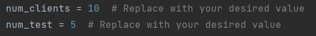

# Calculator RMI Application

This is a Java RMI (Remote Method Invocation) application that provides basic calculator functionality using a server-client architecture. The server implements the `Calculator` interface, which defines various mathematical operations, and the client interacts with the server to perform these operations on a stack.

## Files


### Calculator.java

This is the interface that defines the remote methods to be implemented by the server. It declares methods for pushing values, performing mathematical operations, printing the stack, checking if the stack is empty, and more.

### CalculatorImplementation.java

This is the server-side implementation of the `Calculator` interface. It contains the logic for the stack and the mathematical operations. The server exposes these methods for remote invocation by the client.

### CalculatorServer.java

This is the server main class responsible for starting the RMI server. It instantiates the `CalculatorImplementation` class, binds it to the RMI registry, and makes it available for the client to access.

### CalculatorClient.java

This is the client-side code responsible for interacting with the server. The client presents a command-line interface to the user, allowing them to push values onto the stack, perform mathematical operations, and retrieve stack information.

### ClientTest.java

This file implements all the same functionality as CalculatorClient.java without any additional output for the user, this file is used for testing. 

### test.py

Initializes multiple clients asynchronously (uses ClientTest instead of CalculatorClient for easy input and output), this script gets its input from test/in/input_{NUMBER}.txt and compares the output of the client with test/output/reference_output_{NUMBER}.txt

## How to Run

Follow these steps to run the RMI calculator application:

1. Compile the source code:
   ```
   make
   ```

2. Start the server:
   ```
   make server
   ```

3. In a separate terminal or command prompt, start the client:
   ```
   make client
   ```
### OR

4. Run tests in separate terminal with:
   ```
   make test
   ```
   NOTE: Running the above command requires python 3 installation.
### Custom tests
   To add custom tests, create a new file in test/in folder with name input_{NUMBER}.txt and it's reference output in test/output/reference_output_{NUMBER}.txt

   Update the following parameters in test.py file to perform the tests:

   
   num_clients: Change the number of clients
   
   num_test: Change the number of tests

   Note: The actual number of clients will be num_test * num_clients

### Input File Format
Sample input file:

| Operation | Value |
|-----------|-------|
| 1         | 12    |
| 1         | 24    |
| 1         | 36    |
| 1         | 48    |
| 4         | gcd   |
| 3         | 1000  |
|           |       |
| 1         | 5     |
| 1         | 9     |
| 1         | 4     |
| 1         | 7     |
| 1         | 8     |
| 4         | lcm   |
| 2         |       |

   An empty line has been left after every command that produces an output for human interpretation. For operations see the documentation below (CalculatorClient.java and ClientTest Operations).

## CalculatorClient.java and ClientTest Operations

### Following operations can be performed using the client: 

1. **Push Value**
    - Description: Pushes a given integer value onto the stack.
    - Input: An integer value to be pushed onto the stack.
    - Usage: Enter `1` from the menu, then input the integer value to push onto the stack.

2. **Pop Value**
    - Description: Pops (removes and returns) the top value from the stack.
    - Usage: Enter `2` from the menu.

3. **Delay Pop Value**
    - Description: Pops (removes and returns) the top value from the stack after a specified delay.
    - Input: An integer value representing the delay time in milliseconds.
    - Usage: Enter `3` from the menu, then input the delay time in milliseconds.

4. **Push Operation**
    - Description: Performs a specific mathematical operation on the values present in the stack and pushes the result back onto the stack.
    - Input: A mathematical operation keyword (e.g., "min," "max," "gcd," "lcm").
    - Usage: Enter `4` from the menu, then input the operation keyword.

5. **Check if Stack is Empty**
    - Description: Checks if the stack is empty.
    - Usage: Enter `5` from the menu.

6. **Exit the Program**
    - Description: Exits the client program and terminates the connection with the server.
    - Usage: Enter `-1` from the menu.

## Note

- Used ClientID at the time of method invocation for uniquely identifying the clients and use a separate stack for each client. 

